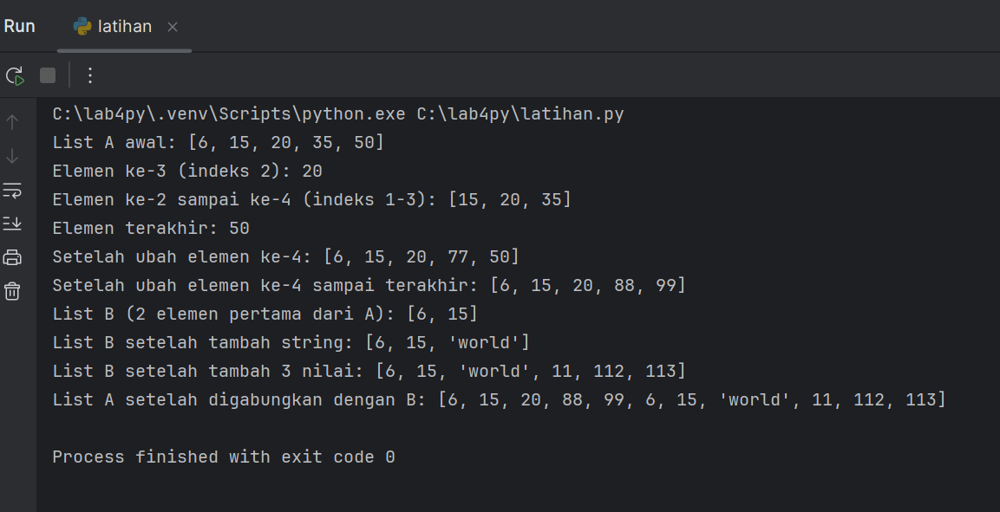

# List dan Tuple

## Modul Praktikum 4

### LATIHAN
Latihan ini bertujuan untuk menguji kemampuan dasar terhadap list, yaitu:
1. **Indexing** = mengambil nilai berdasar posisi
2. **Slicing** = mengambil potongan list
3. **Assignment** = mengubah nilai dalam list
4. **Append & extend** = menambahkan item ke dalam list
5. **Concatenation** = menggabungkan list

Berikut adalah dokumentasi proses pengerjaan latihan:

Dan, berikut adalah output dari latihan tersebut:

### PRAKTIKUM
Dibuat program yang dapat menambahkan data mahasiswa sebanyak-banyaknya ke dalam list, lalu menampilkan daftar data ketika pengguna berhenti memasukkan input.
1. **Membuat list kosong** = List digunakan untuk menyimpan data mahasiswa lebih dari satu. Setiap mahasiswa akan disimpan sebagai dictionary dan dimasukkan ke dalam list ini menggunakan append().
2. **Mulai perulangan input** = While True digunakan agar program terus berulah sampai ada perintah `break`.
3. **Menginput data mahasiswa** = Data per mahasiswa disimpan kedalam Dictionary agar data terstruktur, mudah diproses dalam loop. Semua nilai tugas, UTS, dan UAS dikonversi ke `float` karena bertipe angka.
4. **Menghitung nilai akhir** = Menggunakan rumus bobot 30% dari tugas, 35% dari UTS dan 35% dari UAS. Nilai kemudian dibulatkan.
5. **Menyimpan dictionary ke list** = Setiap mahasiswa baru akan ditambahkan ke list.
6. **Mengkonfirmasi data** = Jika user mengetik “t”: loop berhenti dan lanjut menampilkan data. Namun, jika mengetik “y”: kembali ke awal loop (input lagi)
7. **Menampilkan tabel** = Hasil akhirnya adalah tabel dengan penggunaan fungsi <20, <15, <8, dst. agar kolom tabel rapi.

Berikut adalah dokumentasi proses pengerjaan praktikum:

Berikut adalah alur kerja program pendataan nilai mahasiswa:

Dan, berikut adalah output dari latihan tersebut:

